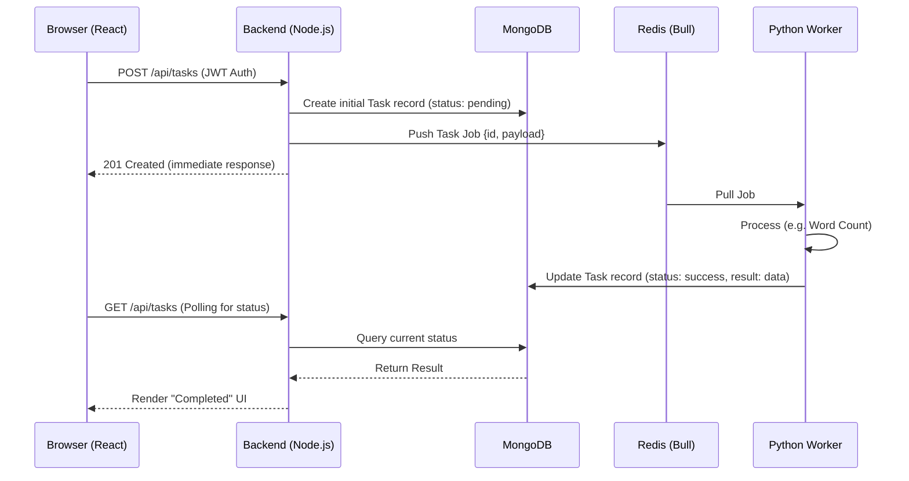

# Architecture Document: AI Task Processing Platform

## 1. System Overview
The AI Task Processing Platform is a state-of-the-art, distributed MERN-stack application designed to handle large-scale, asynchronous text processing requests. By decoupling the API from the processing logic using a Redis-backed message queue and a scalable Python worker pool, the system ensures high availability, fault tolerance, and the ability to process over 100,000 tasks per day.

---

## 2. Component Architecture

### 2.1 Frontend (React.js + Vite)
*   **Aesthetics**: Utilizes a premium Glassmorphism design system with dark mode defaults and dynamic micro-animations.
*   **State Management**: Uses React Context API for authentication and global task state tracking.
*   **Optimization**: Built with Vite for ultra-fast HMR and optimized production bundling.

### 2.2 Backend API (Node.js + Express)
*   **Gateway**: Serves as the central orchestrator for User Authentication (JWT) and Task Validation.
*   **Producer Logic**: Implements the **Producer** pattern by pushing validated tasks into a Redis-backed Bull queue.
*   **Database Integration**: Interacts with MongoDB via Mongoose for high-performance persistence.

### 2.3 Task Queue (Redis + Bull)
*   **Broker**: Acts as a high-speed message broker. Redis's in-memory nature allows for sub-millisecond task handoffs.
*   **Reliability**: Configured with persistent storage (RDB/AOF) to ensure no tasks are lost in the event of a Redis restart.

### 2.4 Distributed Worker (Python)
*   **Consumer Logic**: A dedicated Python service designed for heavy-duty text manipulation (uppercase, word count, regex filtering).
*   **Scale-Out**: Stateless architecture allowing for horizontal scaling via Kubernetes HPA.
*   **Interoperability**: Connects to the Redis Bull Queue via a specialized Python parser.

---

## 3. Data Flow & Sequence

---

## 4. Key Engineering Strategies

### 4.1 Scalability & High Volume (100k+ tasks/day)
*   **Worker HPA**: The system is configured with a `HorizontalPodAutoscaler` that monitors CPU and Memory. During peak loads, the cluster automatically scales the Python worker pool from 2 to 10 replicas.
*   **Connection Pooling**: Uses `maxPoolSize` in MongoDB and persistent Redis connections to prevent socket exhaustion.
*   **Non-Blocking I/O**: The Node.js event loop remains free by offloading the processing to Python workers.

### 4.2 GitOps & CI/CD Pipeline
*   **Single Source of Truth**: All infrastructure manifests live in a dedicated GitOps repository.
*   **Argo CD**: Automatically synchronizes the cluster state with the Git repository.
*   **GitHub Actions**: Triggers on every push to `master`. It builds Docker images, pushes to DockerHub, and updates the GitOps repo with new image tags using `[skip ci]` to prevent infinite loops.

### 4.3 Database Optimization (Indexing)
To support 100k+ tasks daily without performance degradation:
*   `{ email: 1 }`: Unique index for instant authentication lookups.
*   `{ userId: 1, createdAt: -1 }`: Compound index for fast retrieval of historical user data.
*   `{ status: 1 }`: Sparse index for worker polling queries.

### 4.4 High Availability & Resilience
*   **Liveness/Readiness Probes**: Kubernetes monitors all service health. If the Python worker loses connection to Redis, K8s automatically restarts the pod.
*   **Graceful Shutdown**: The Backend API implements `preStop` hooks to finish ongoing Redis transactions before a pod is terminated during a deployment.

---

## 5. Environment Separation (Kustomize)
We utilize **Kustomize Overlays** to maintain parity between Development and Production while allowing specific configuration overrides:
*   **Dev**: Uses `dev-` namePrefix, debug logging, and single-instance replicas.
*   **Prod**: Uses `prod-` namePrefix, info logging, 3+ replicas, and strict resource limits.
